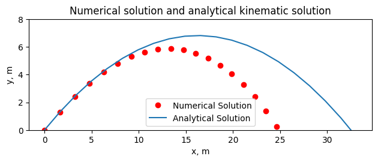
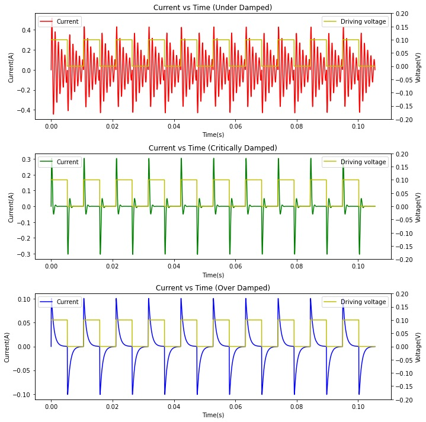
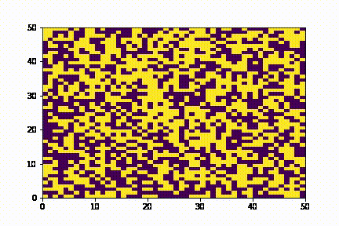
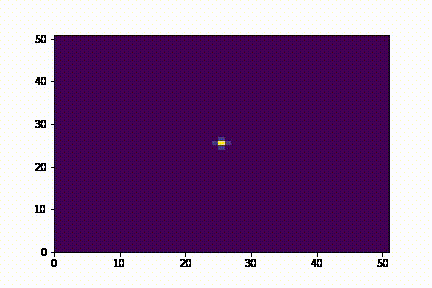

# 210 Projects

This repo features a collection of projects made for PHYS 210 at UBC. The projects are a set of 5 physics simulations written in python with an emphasis on numpy usage. I would later go on to help restructure the course with Professor Joss Ives. This repo includes the following:

    
    

        <h3 class="project-name">
            <strong>1) Air Drag Simulation</strong>
        </h3>
        

            Air drag simulation, with numerical solving of the drag equations(shows the difference between a falling projectile in a vaccum and in air)
        

    

    
    

        <h3 class="project-name">
            <strong>2) RLC Circuit simulation</strong>
        </h3>
        

            RLC circuit simulation with a current and voltage reading(simulates a circuit with resistor, capacitor, and inductor components)
        

    

    
    

        <h3 class="project-name">
            <strong>3) Ising Model Simulation</strong>
        </h3>
        

            Ising model simulation with Curie temperature reading(explains why objects become paramagnetic at low temperatures). Also features an animation!
        

    

    
    

        <h3 class="project-name">
            <strong>4) Gas Particle Simulation</strong>
        </h3>
        

            Gas particle simulation with calculations of average velocity and kinetic energy(comparison to expected theoretical values). Also features an animation!
        

    

    
    

        <h3 class="project-name">
            <strong>5) Liquid simulation</strong>
        </h3>
        

            Fluid concentration simulation with spread of a concetration of some solute(shows how things like food dye spread in a liquid). Also features an animation!
        

    

